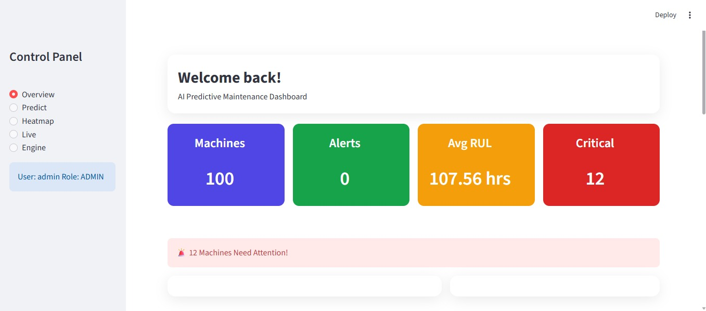

# Cloud Native GEN AI for Industrial Maintenance

## Overview

Cloud Native GEN AI for Industrial Maintenance is an intelligent maintenance management system designed to improve industrial equipment monitoring and predictive maintenance using Generative AI and cloud-native technologies.

The project helps industries detect issues early, automate maintenance workflows, analyze operational data, and provide AI-driven insights for efficient decision-making.

This system is developed using Python, Streamlit, Docker, and machine learning pipelines to create a scalable and user-friendly industrial maintenance platform.

---

## Features

* Predictive maintenance using AI models
* Cloud-native architecture
* Real-time industrial data processing
* Streamlit-based interactive dashboard
* Docker containerization support
* Automated data pipeline
* Fault analysis and monitoring
* JSON payload-based processing
* Scalable deployment support

---

## Technologies Used

* Python
* Streamlit
* Docker
* Docker Compose
* Machine Learning
* Generative AI
* Data Pipelines
* JSON Processing

---

## Project Structure

```bash
Cloud-Native-GEN-AI/
│
├── apps/                 # Streamlit application files
├── data_pipeline/        # Data preprocessing and pipeline scripts
├── scripts/              # Utility and helper scripts
├── Dockerfile            # Docker configuration
├── docker-compose.yaml   # Multi-container setup
├── payload.json          # Sample input payload
├── payload_fixed.json    # Processed payload
├── requirements.txt      # Python dependencies
└── README.md             # Project documentation
```

---

## Installation

### Install Dependencies

```bash
pip install -r requirements.txt
```

---

## Run the Application

### Using Streamlit

```bash
streamlit run app.py
```

### Using Docker

```bash
docker-compose up --build
```

---

## Applications

* Industrial equipment monitoring
* Predictive maintenance systems
* Fault detection
* AI-based operational analysis
* Smart manufacturing support

---

## Future Enhancements

* Real-time IoT sensor integration
* Advanced GEN AI chatbot support
* Cloud deployment using Kubernetes
* Automated alert system
* Enhanced analytics dashboard

---

## Output Screenshots
### Login Page


---

### Dashboard



---

### Alert Message


---

### Engine Predictive History


---

### RUL Trends


---

## License

* Final Year Project

This project is developed for educational and academic purposes.
